#  Benign ve Malign tümörlerin neden olduğu klinik problemler 

+ Yerleşim , infiltrasyon ve  baskı  nedeniyle  çevre  dokulara  verilen  hasar
+ Fonksiyonel  ürünler
	+ Hormon  sentezi
	+ Paraneoplastik  sendromlar
+ Kanama  ve  enfeksiyonlar
	+ Tümör  komşu  yüzeylere  ülsere  olur
+ Rüptür  ya da infarkt
+ Kaşeksi , belirgin  zayıflama

---
#  Tümörün konak üzerindeki etkileri 

+ Tümörün  yeri
	+ 1 cm hipofiz  adenomu   hipopitüitarizm
	+ 0.5 cm renal arterde  leiomyom  iskemi  ve  hipertansiyon
	+ Safra  yolunda  küçük  bir  tümör  Kolestaz  ve  ölüm

---
#  Tümörün konak üzerindeki etkileri 

+ Hormon  üretimi
	+ Adacık  hücre benign ve malign tümörleri   hiperinsülnemi  hipoglisemi
	+ Adrenokortikal neoplaziler  hiperaldesteronizm

---
#  Tümörün konak üzerindeki etkileri 

+ Ülser
	+ GIS tümörleri
	+ İntususepsiyon
	+ İntestinal obstrüksiyon
	+ İnfarkt

---
#  Kanser Kaşeksisi 

+ Vücut  yağının  giderek  kaybı
+ Vücut  ağırlığının  giderek  kaybı
+ Belirgin  zayıflık
+ Anoreksi
+ Anemi

---
#  Kaşeksi 

+ Kanserin  boyu  ve  yayılımı  ile  kaşeksinin  ciddiyeti  ilişkilidir

---
#  Kaşeksi 

+ Tumörlerde
	+ Kalori  harcaması  artmış
	+ Bazal  metabolik  hız  artmıştır
	+ Normalde  gıda  alımı  azaldığı  için  açlık  olarak  algılanmalı  idi
+ Kaşeksi  tümörün  beslenme  ihtiyacından  dolayı  ortaya  çıkmaz
+ Kaşeksi  nedeni  tümör  ve  stromadan  salgılanan  sitokinlerdir

---
#  Kaşeksi 

+ TNF
	+ Makrofajlar  tarafından  tümöre  cevap  olarak  üretilir
	+ Tümör  hücrelerinden  kaynaklanır
+ TNF
	+ İştahı  baskılar
	+ Lipoprotein lipaz  aktivitesini  engeller
	+ Lipoproteinlerden  serbest  yağ  asitinin  açığa  çıkmasını  engeller
+ Proteolysis-inducing factor
	+ Proteinleri mobilize eden  bir  faktör
	+ İskelet  kası  proteinlerini  ubikitin-proteozom  yolağı  ile  yıkar
+ Kaşeksinin  tedavisi  tümörün  ortadan  kaldırılmasıdır

---

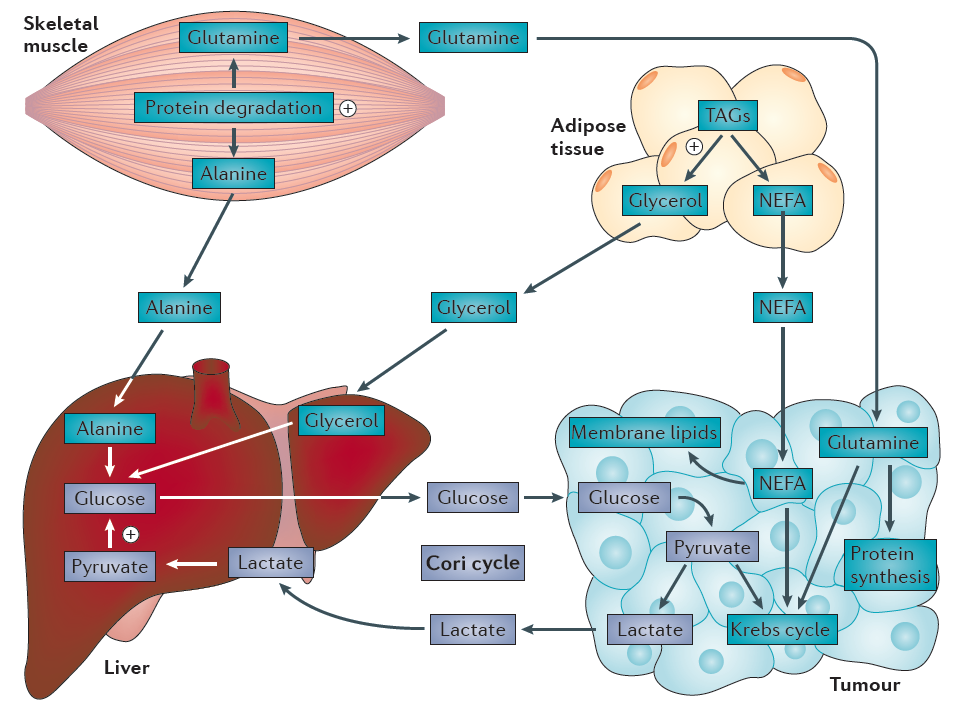

---

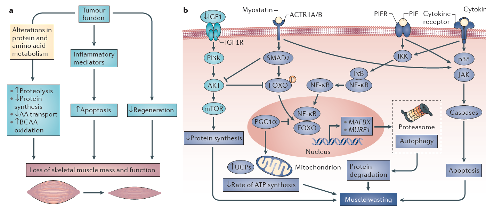

---

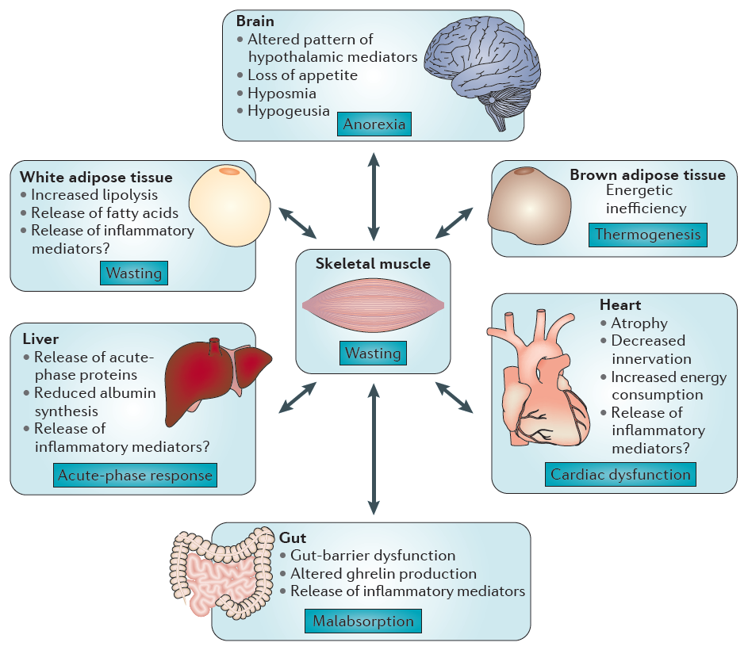

---
#  Paraneoplastik Sendromlar 

+ Tümörün  lokal  ya da uzak  yayılımı  ile  açıklanamayacak  belirtiler
+ Beklenmedik  hormon  ekspresyonu
+ Farkedilmesi  önemlidir :
	+ Okkült  bir  tümörün en erken  bulgusu
	+ Klinik  olarak  belirgin  hastalığa  neden  olur  ve  ölümcül  olabilir
	+ Metastazı  taklit  eder , tedavi  değişikliğine  neden  olur

---

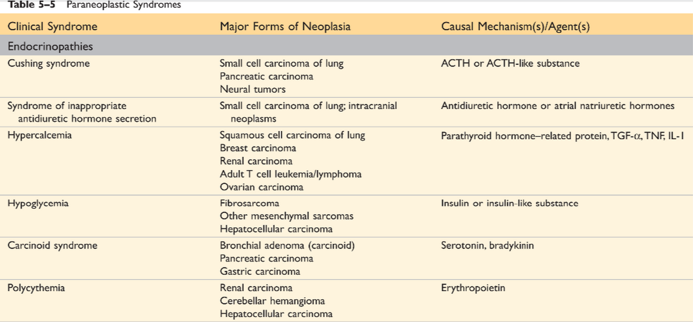

---

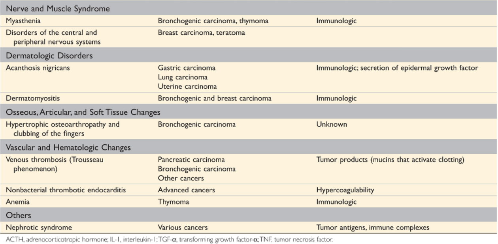

---
#  Paraneoplastik Sendromlar 

+ Hiperkoagülasyon
	+ Venöz  tromboza  neden  olur
	+ Aseptik  trombotik  endokardit
+ Akciğer  karsinomları
	+ Parmaklarda  çomaklaşma
	+ Hipertrofik  osteoartropati

---
#  Grade (Derece) 

+ Kullanım  amacı  tümörün
	+ A gresifliğini
	+ Malignite  seviyesini  ortaya  koymak
+ Temel  aldığı  özellikler
	+ Tümör  hücrelerinin  sitolojik  farklılaşmaları
	+ Tümör  içindeki  mitoz  sayısı
+ Grade I, II, III, or IV   artan  miktarda  anaplazi

---
#  Farklı tümörler için farklı derecelendirmeler kullanılır 

+ Her neoplazi  için  kullanılan  kriterler de farklıdır
+ Fuhrman Grade
+ Gleason Grade ve  Skor
+ FIGO Grade

---

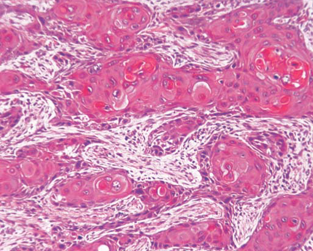

---

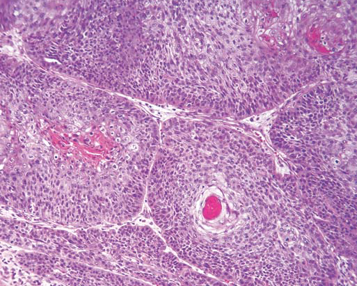

---

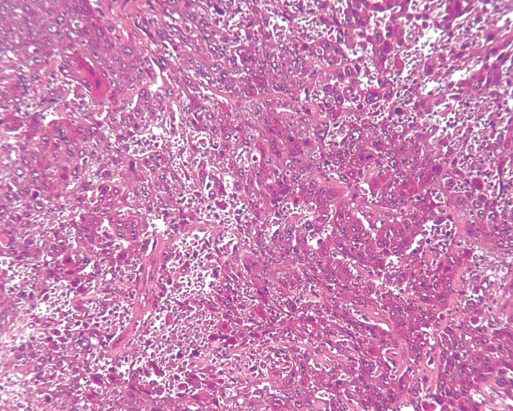

---

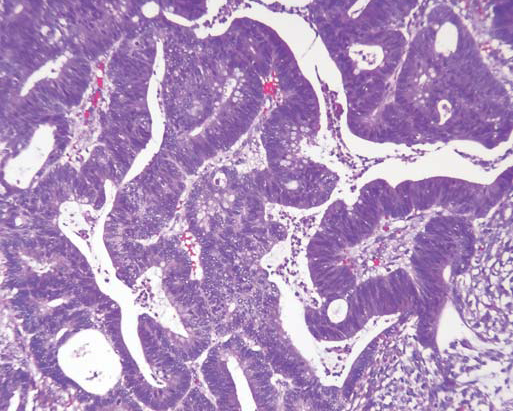

---

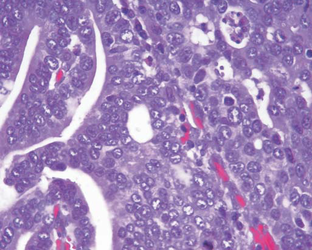

---

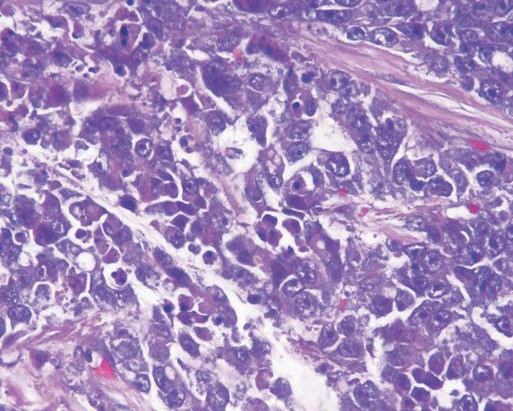

---
#  Stage (Evre) 

+ Temel  aldığı :
+ Primer lezyonun  boyu  ve  lokal  dokulara  yayılım  miktarı
+ Bölgesel  lenf  nodlarına  yayılım
+ Metastaz  varlığı  veya  yokluğu

---
#  Stage 

+ TNM sistemi
+ T0, T1, T2, T3, T4
	+ Primer lezyonun  boyu  ve  lokal  dokulara  yayılım  miktarı
+ N0, N1, N2
	+ Bölgesel  lenf  nodlarına  yayılım
+ M0, M1
	+ Metastaz  varlığı  veya  yokluğu

---
#  Stage 

+ AJCC/ UICC sistemi
+ T, N, M’leri  baz  alır
+ 4 grup  altında  birleştirir
	+ Stage I, II, III, IV
	+ Her organ için  kombinasyon  değişkendir
+ FIGO jinekolojik  tümörler  için  evreleme  sitemi

---

.pull-left[]

.pull-right[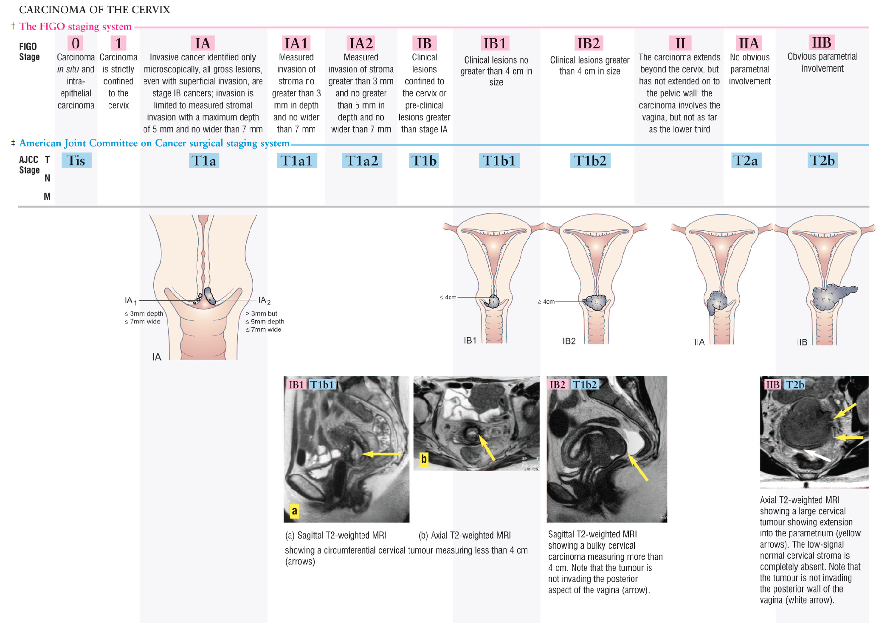]

---

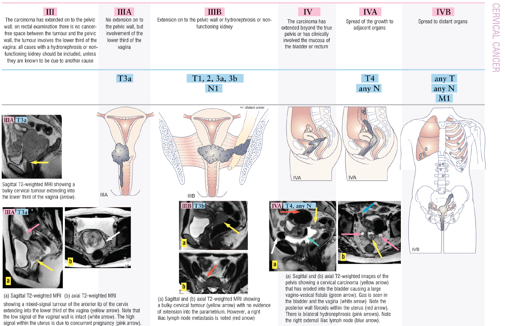

---

.pull-left[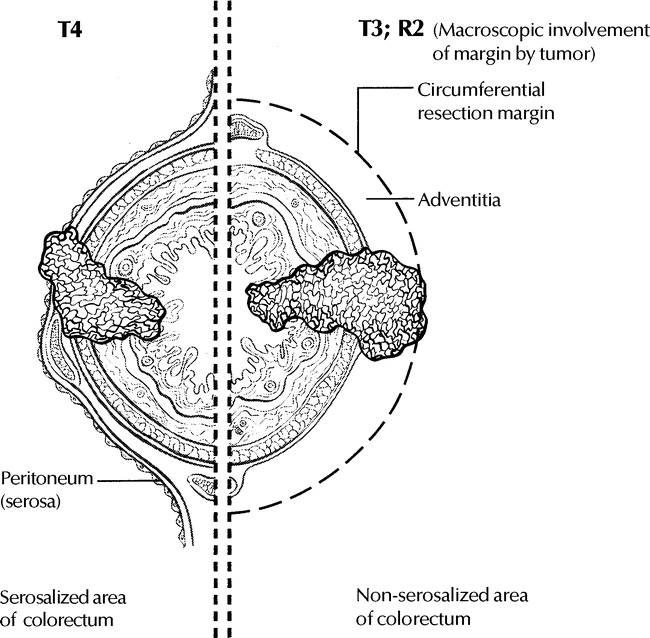]

.pull-right[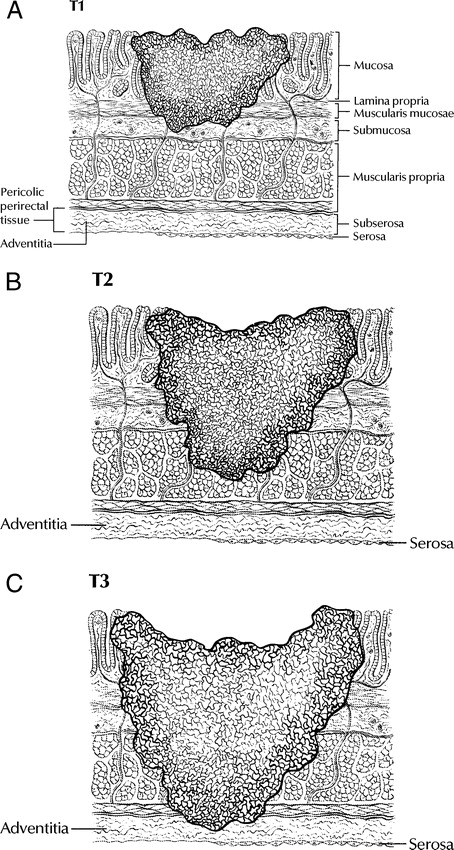]

---

.pull-left[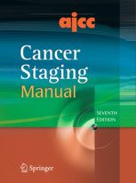]

.pull-right[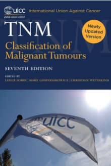]

---

---
#  Kanserin Laboratuvar Tanısı 

+ Morfolojik  Yöntemler
+ Tümör  belirteçleri (marker)
+ Moleküler  Tanı

---
#  Morfolojik Yöntemler 

+ Patolog  tarfından  yapılır
	+ Makroskopik  ve  mikroskopik  özellikler  kullanılır
+ Normal ve  bariz  maligniteleri  ayırmak  kolaydır
+ Arada  kalan  vakalar  zor  tanı  konan  problemli  olgulardır

---
#  Her olgu için klinik bilgi verilmesi şarttırBazı vakalarda ise tanının olmazsa olmazıdır 

+ Cilt  ve  mukozadaki  radyasyon  etkisi  tümörle  karışabilir
+ İyileşme  dönemindeki  kemik  kırığı  osteosarkomla  karışabilir
+ Giant cell tumor of bone vs bone cysts vs  hyperparathyroidism

---
#  Spesmen – Patolojik Örnek 

+ Yeterli  olmalı
+ Temsili  olmalı
+ Uygun  korunmuş  olmalı
	+ Formaldehit

---
#  Spesmen türleri 

+ Radikal  Cerrahi
+ Eksizyonel  biyopsi
+ Tru -cut ( iğne ) biopsi
+ Int J Surg Case Rep . 2014; 5(1): 30–33
.pull-left[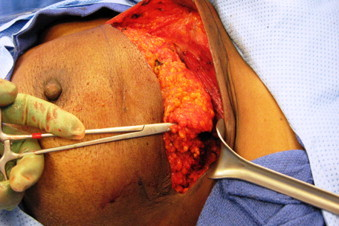]

.pull-right[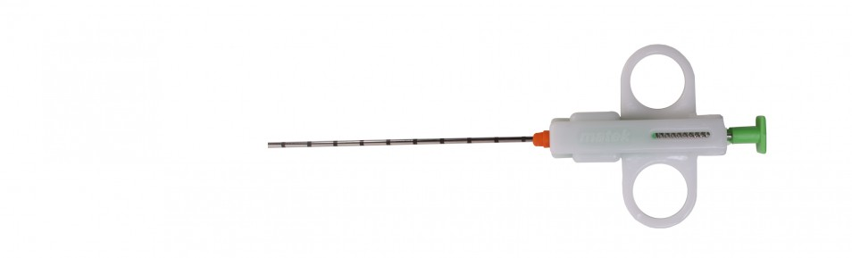]

---
#  Frozen 

+ http:// www.ihcworld.com /
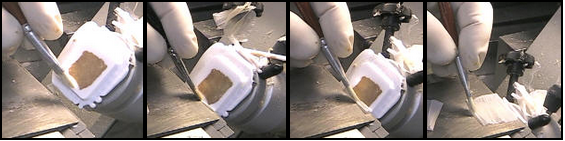

---
#  İnce İğne Aspirasyon Sitolojisi 

+ Kitledeki  hücrelerin aspire edilmesi
+ Yaymaların  sitolojik  olarak  incelenmesi
+ Ele  gelen  kitlelerde
	+ Meme
	+ Tiroid
	+ Lenf  nodu
	+ Tükrük  bezi

---
#  İnce İğne Aspirasyon Sitolojisi 

.pull-left[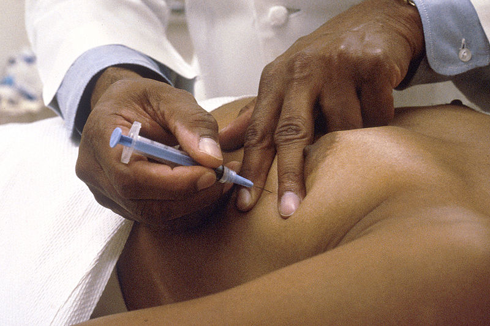]

.pull-right[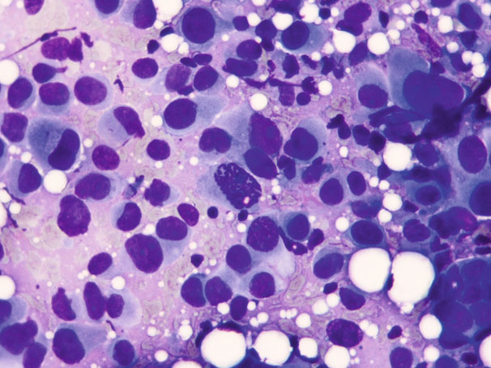]

---

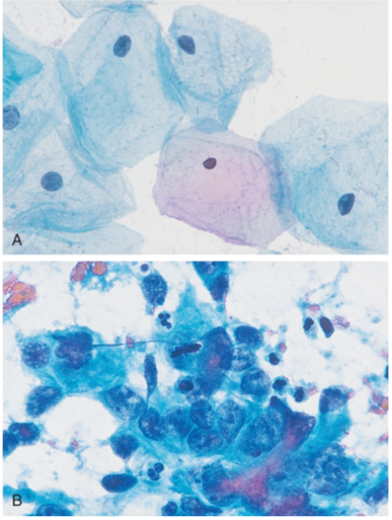

---
#  İmmünohistokimya 

+ Bancroft's Theory and Practice of Histological Techniques
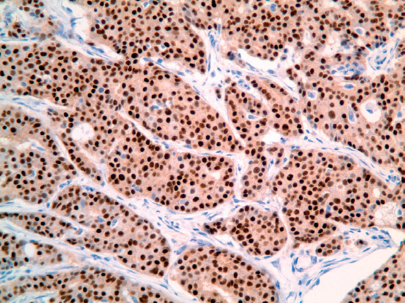

---
#  Akım Sitometri 

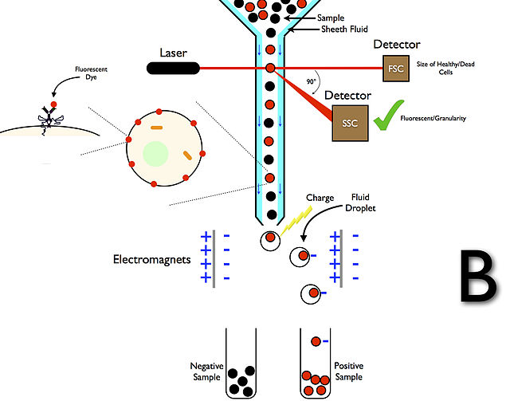

---
#  Tümör Belirteçleri 

+ Tümör  ilişkili , kandan  tespit  edilebilen  enzim , hormon  ve  diğer  tümör  belirteçleri
+ Kanserin KESİN tanısı  değildir
+ Taram  testi
+ Tedaviye  cevap
+ Rekürrensin  tespiti
+ PSA
+ CEA
+ AFP
+ CA-125
+ CA19-9

---
#  Moleküler Yöntemler 

+ Malignite  tanısı
+ PCR
	+ Lenfoid Neoplazilerde
	+ T hücre  reseptör  ve  Ig gen monoklonalitesi
+ FISH
	+ Translokasyon
	+ Ewing sarkomu , lenfomalar, lösemiler

---

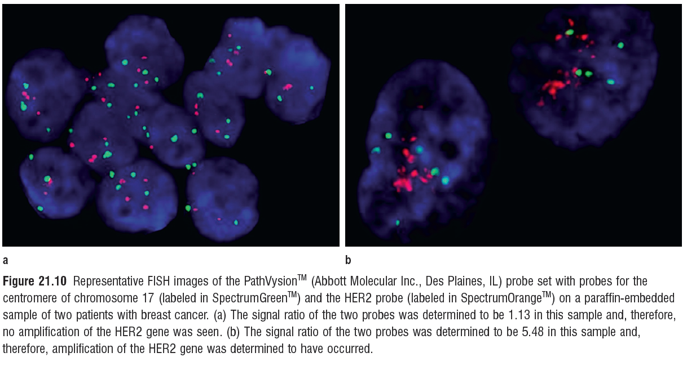

---
#  Moleküler Yöntemler 

+ Prognoz ve  davranış
+ FISH
	+ Her2/ Neu
	+ N- Myc

---
#  Moleküler Yöntemler 

+ Minimal rezidü hastalığın  tespiti
	+ BCR -ABL transkriptlerinin PCR ile  tespiti
	+ KML rezidü hastalığın  tespiti

---
#  Moleküler Yöntemler 

+ Kansere  herediter  yatkınlığın  tespiti
	+ BRCA1
	+ Mikrosatellit  instabilite

---
#  Moleküler Yöntemler 

+ Tedaviye  kara  verirken
+ Hedefe  yönelik  tedavi
+ Akciğer karsinomu
	+ ALK kinaz  mutasyonu
+ Melanom
	+ BRAF V600E mutasyonu
+ Kolon  kanseri
	+ RAS mutasyonu

---

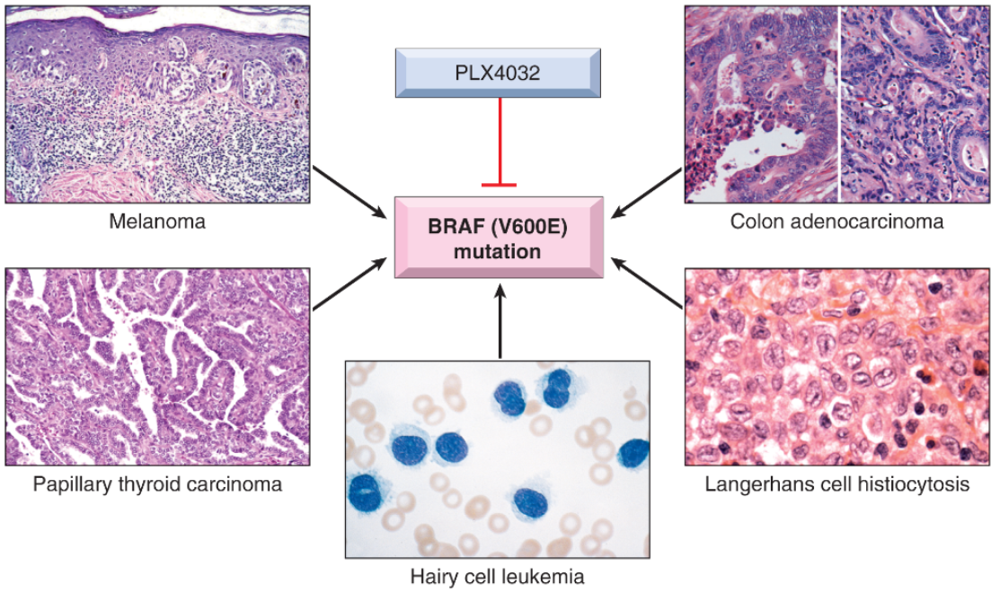

---

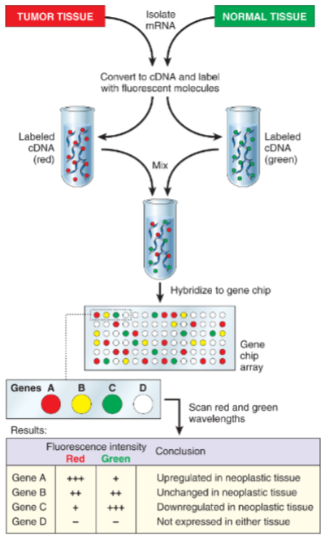

---
#  Tümörün moleküler profili 

+ Tüm  genom  sekanslaması
	+ Whole Genome Sequencing
+ Tümörler  birkaç  belirgin  somatik  mutasyon  içerir
	+ Çocukluk  çağı  lösemiler
+ Onbinlerce  mutasyon
	+ Mutajene  maruziyet , deri , akciğer

---
#  İki tip mutasyon 

+ Sürücü (Driver) mutasyonlar
	+ Hücre proliferasyonunun konrolünü , farklılaşmayı  ve  homeostazı  değiştirir
	+ Neoplastik süreci  devam  ettirir
	+ Tedavi  için  hedeftir
+ Yolcu (Passenger) mutasyonlar
	+ Hücre  fenotipine  etkisi  olmaz
	+ Sürücü  mutasyonlardan  sayıca  çok  fazladır
	+ Genomun  kodlanmayan  kısmında  olurlar
	+ Tümör  büyümesi  konusunda  etkileri  nötrdür , avantaj  ya da dezavantaj  taşımazlar

---
#  Sürücü mutasyonlar 

+ Tekrarlayan  şekilde
	+ Bir  kanser  grubunda  çoğu  hastada  mevcut
	+ BCR -ABL füzyonu
+ Belirli  bir  tümör alt grubunda da olabilir
	+ Küçük  hücre  dışı  akciğer  tümörlerinin  sadece %4’ünde EML4 -ALK tirozin  kinaz  füzyonu  olur
	+ Bu grup ALK inhibitörlerine  cevap  verir

---

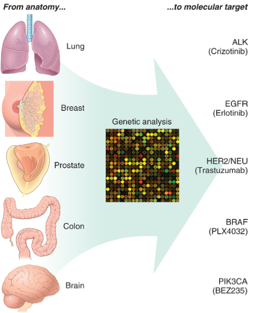

---
#  Klinik gidişi etkileyen faktörler 

+ Sağkalımı  etkileyen  faktörler
+ Tümörün  histolojik tipi
+ Derecesi
+ Preinvaziv  komponentin  varlığı
+ Tümör  boyutu
+ Perinöral  invazyon
+ Lenfatik  invazyon
+ Venöz  invazyon
+ Evre T, N, M
+ Herediter  sendromlar  için  ipuçlarıClues  for hereditary syndromes

---
#  Patolojide kullanılan belirteçler 

+ Tanısal
	+ Diagnostic
+ Çıkarımsal
	+ Predictive
+ Prognostik
	+ Prognostic
+ Tedaviye  yönelik
	+ Therapeutic

---
#  Patoloğun ürünü raporudur 

+ Raporda ne olmasını  bekleriz ?
+ Klinik  gidişi  etkileyecek  tüm  morfolojik , fenotipik , moleküler  özellikler
+ Kontrol  listeleri , CAP
+ c ap.org / cancerprotocols

---
#  Epidemiyoloji 

+ Epidemiyolojik  veriler  kanser  ile  ilişkili  faktörlerin  bulunması  için  kullanılır
+ Sigara   Akciğer  kanseri
+ Tüketilen  yağ  ve  lif  oranı  Kolon  kanseri
+ Çevresel , ırk ( herediter ), kültürel  etkiler

---
#  Kanser insidansı 

+ Popülasyon  başına  tanı  alan  yeni  kanser  hastası  sayısı
+ ABD
	+ 2011’de 1,5 milyon  yeni  kanser  tanısı  alan hasta
	+ 569,000 kanserden  öldü
+ Türkiye
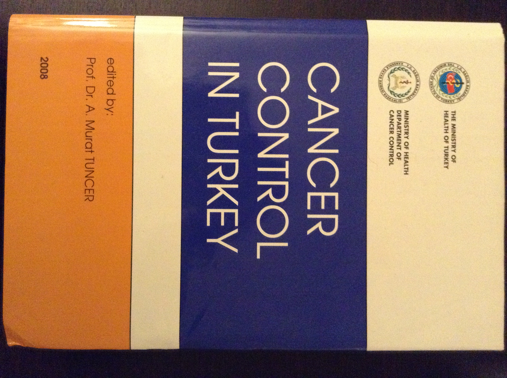

---

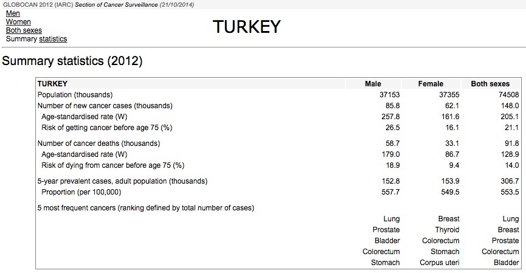

---

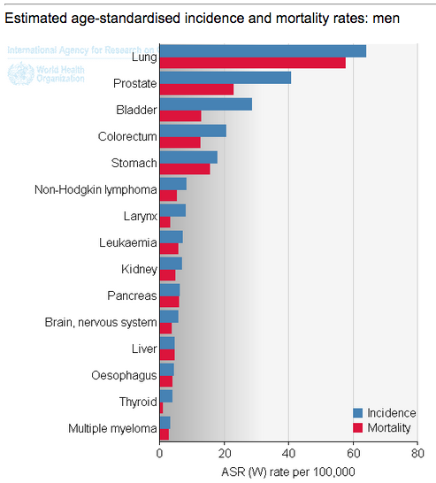

---

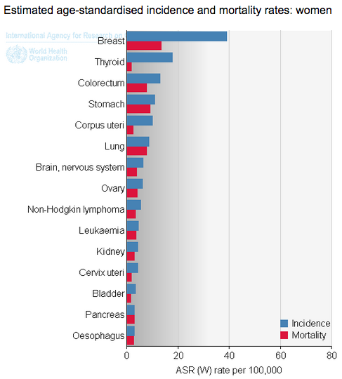

---

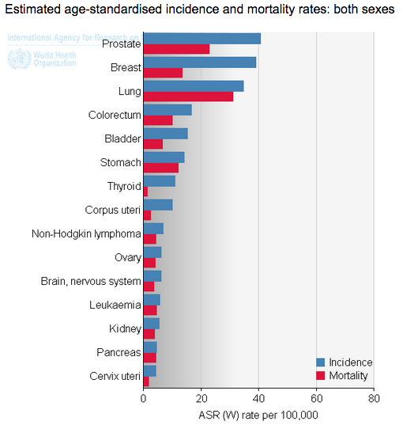

---

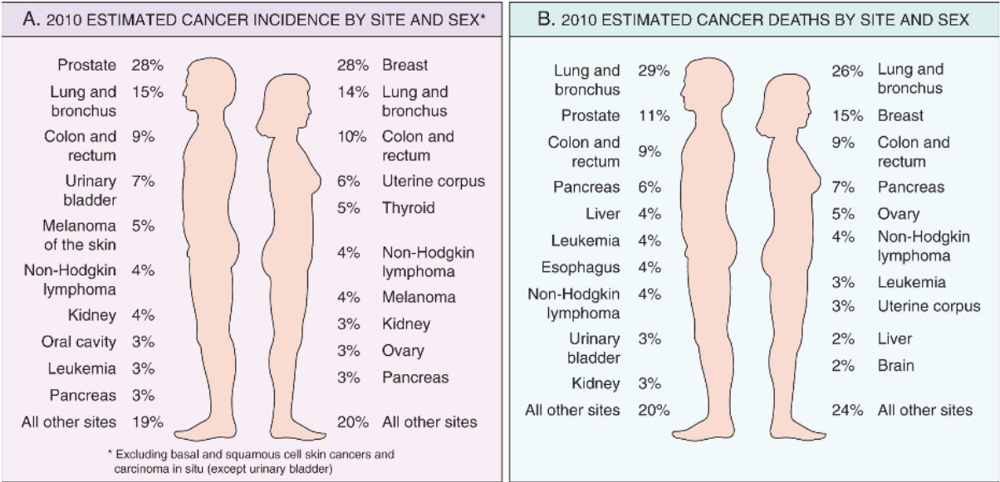

---
#  Kanser hızları zaman içinde değişmektedir 

+ Erkeklerde  kanserden  ölüm  oranı  artıyor
	+ Akciğer  kanseri
	+ Azalmaya  başladı
+ Kadınlarda  kenserden  ölüm  oranı  hafif  azaldı
	+ Serviks , mide  ve  kalın  barsak  kanser  nedenli  ölümlerde  azalma
	+ Akciğer  kanserinde  belirgin  artış

---
#  Coğrafi ve çevresel etkiler 

+ Çoğu sporadik tümör  için  çevresel  etkiler en önemli  etkenlerdir
+ Coğrafi  farklılıklar
	+ Meme kanseri
		+ Avrupa  ve  ABD’de  Japonyaya  göre 4-5x fazla
	+ Mide  kanseri
		+ Japonyada  ABD’ye  göre 7x fazla
	+ Karaciğer  kanseri
		+ ABD’de  az
		+ Afrikada en önemli  öldürücü  kanser  türü

---
#  Coğrafi ve çevresel etkiler 

+ Çoğu sporadik tümör  için  çevresel  etkiler en önemli  etkenlerdir
+ Bu coğrafi  farklılıklar  genetik  olmaktan  çok  çevrenin  etkisine  bağlıdır
	+ Nisei ( ABD’de  yaşayan  ikinci  kuşak  Japonlar )
	+ Japonya  ve ABD yerlilerinin  ortasında  mortaliteye  sahipler
	+ Her kuşakta  oranlar  yeni  çevreye  daha da yaklaşıyor

---
#  Çevresel karsinojenler heryerde 

+ Çalıştığınız  yerde , yiyeceklerde , yaptığınız her kişisel  aktivitede
+ Güneş  ışığı
+ Asbest
+ Bazı  iş  kolları
+ Bazı  diyet  alışkanlıkları
+ Sigara
+ Kronik  alkol  kullanımı
+ İlk cinsel  aktivite  yaşı
+ Cinsel partner sayısı
+ There is no escape
	+ Everything people do to earn a livelihood, to subsist, or to enjoy life turns out to be illegal, immoral, or fattening, or—most disturbing—possibly carcinogenic.

---

.pull-left[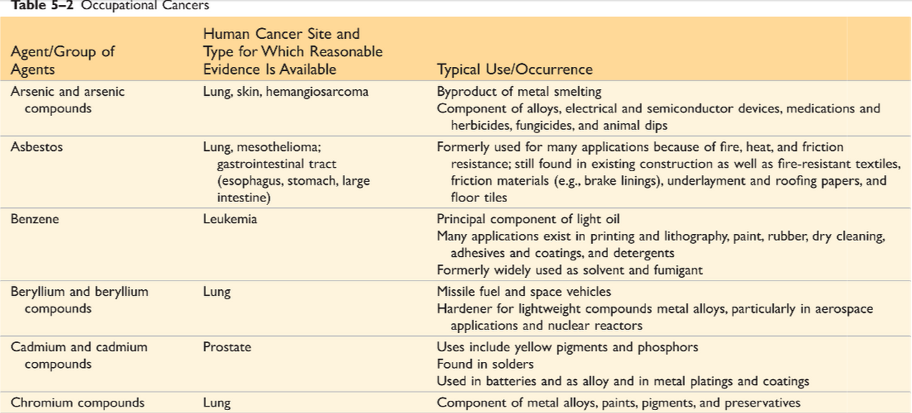]

.pull-right[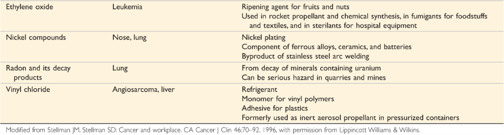]

---
#  ?düşünmek için? 

+ Neden  yaşlılarda  kanser  görülüyor ?
+ Neden  yenidoğanlarda  kanser  görülüyor ?
+ Neden  bazı  kanser  türleri belli yaş  gruplarına  özel ?

---
#  Yaş 

+ Çoğu  kanserden  ölümler 55-75 yaş  arası  olur
+ 75’den sonra normal poülasyon  ölüm  oranına  yaklaşır
+ Yaşla  beraber  artışın  nedeni
	+ Somatik  mutasyonların  birikmesi
	+ İmmün  yanıttaki  azalma

---
#  Yaş 

+ 15 yaş  altı  ölümlerin %10’u kanser  nedenli
+ Çocuklardaki  majör  ölümcül  kanserler
	+ Lösemiler
	+ SSS tümörleri
	+ Lenfomalar
	+ Yumuşak  doku  ve  kemik  sarkomları

---
#  Herediter 

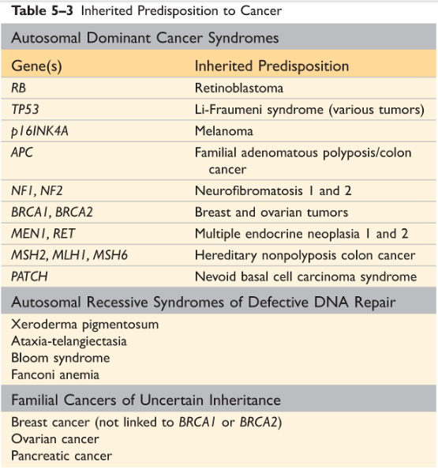

---

---

---

---
#  Neden tüm sigara içenlerde kanser gelişmiyor? 

+ İlaç  metabolizmasındaki  enzimlerdeki  polimorfizmler
+ Akciğer  tümörlerinde  yapılan  Genome -wide association studies (GWAS )
+ Nikotinik  asit  reseptöründe  varyantlar  tespit  etmişler
+ Bu da içilen  sigara  ile  orantılı
+ Bu reseptör  bağımlılığı  etkileyerek  dolaylı  yoldan  kansere  yatkınlık  sağlıyor
+ ? Benim  amcam  günde 3 paket  içiyordu , kanser  filan da olmadı ?

---
#  Akkiz preneoplastik lezyonlar 

+ Preneoplastik  lezyonlar , prekanser
+ Kronik  doku  hasarı  ya da inflamasyon
+ Bronş  mukozasında  skuamöz  metaplazi  ve displazi
	+ Sigara
	+ Akciğer  kanseri  için risk
+ Endometrial hiperplazi  ve displazi
	+ Karşılanmamış  östrojen  etkisi
	+ Endometrial karsinom için risk
+ Oral kavite , vulva ya da peniste  lökoplaki
	+ Skuamöz  hücreli karsinom öncüsü
+ Kolonda  villöz  adenom
	+ Kolorektal  karsinoma  dönüşme  riski  yüksek

---
#  Benign neoplazmın malign neoplazma dönüşme riski nedir? 

+ Benign tümörler  prekanseröz  müdür ?
	+ Kolon  adenomları %50 oranında  maligniteye  dönüşür
	+ Uterus leiomyomlarının  maligniteye  dönüşümü  çok  çok  nadirdir

---
#  Kanserin erken tanısı 

+ Tarama  testleri
	+ Hormon  Belirteçleri
+ PAP Testi
+ HPV Testi
+ KETEM
+ kanser.gov.tr

---
#  Kanser istatistiklerini nereden bulabilirsiniz? 

+ SEER: seer.cancer.gov /
+ Globocan : globocan.iarc.fr /
+  http://www.cancerindex.org/ Turkey

[http://www.cancerindex.org/](http://www.cancerindex.org/Turkey)
[Turkey](http://www.cancerindex.org/Turkey)
